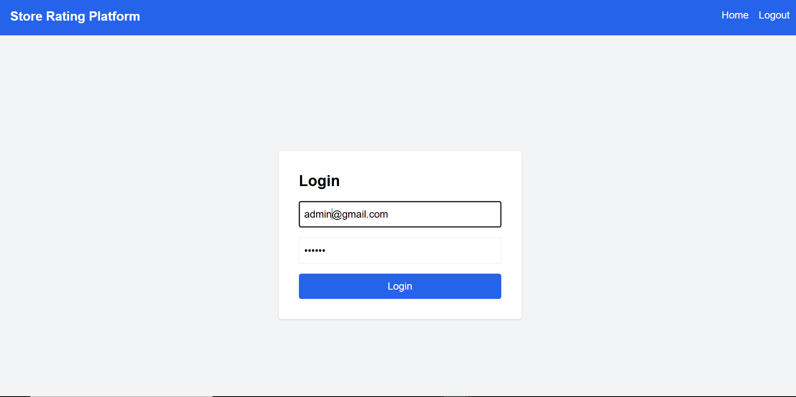
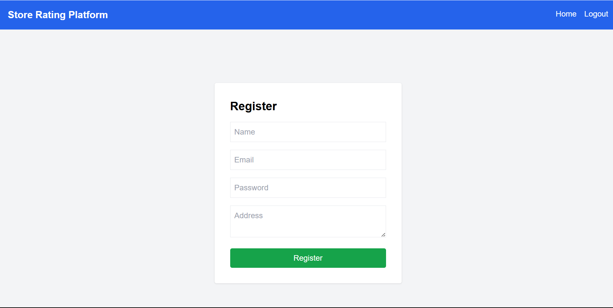
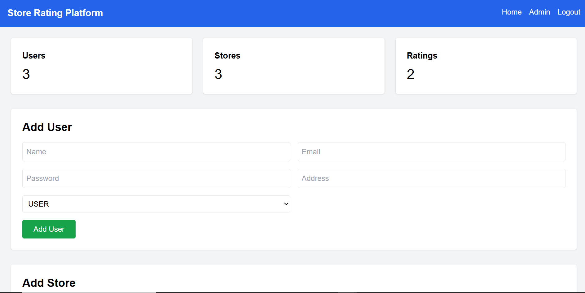
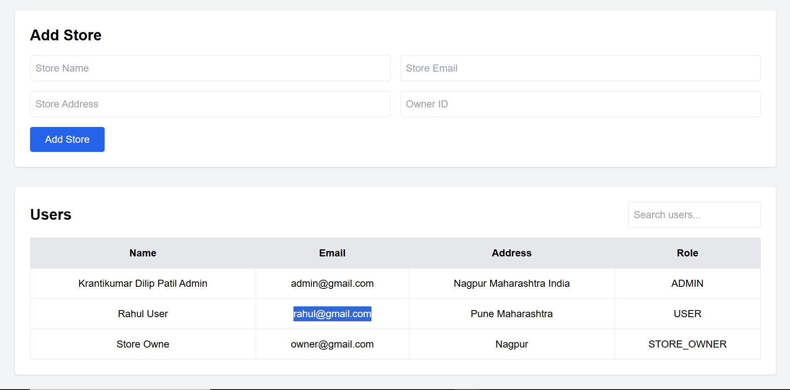
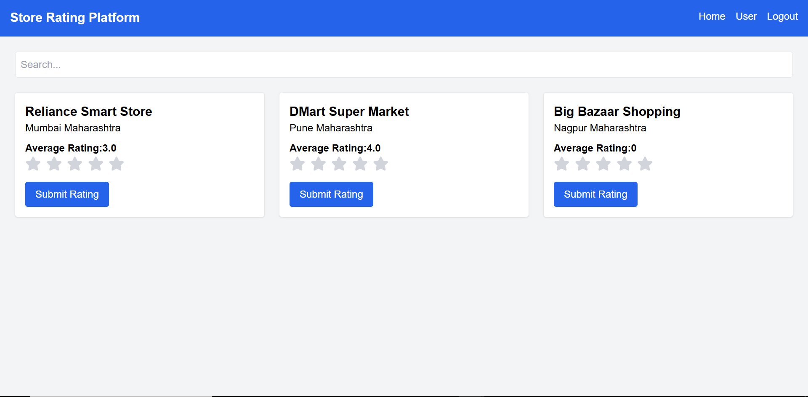
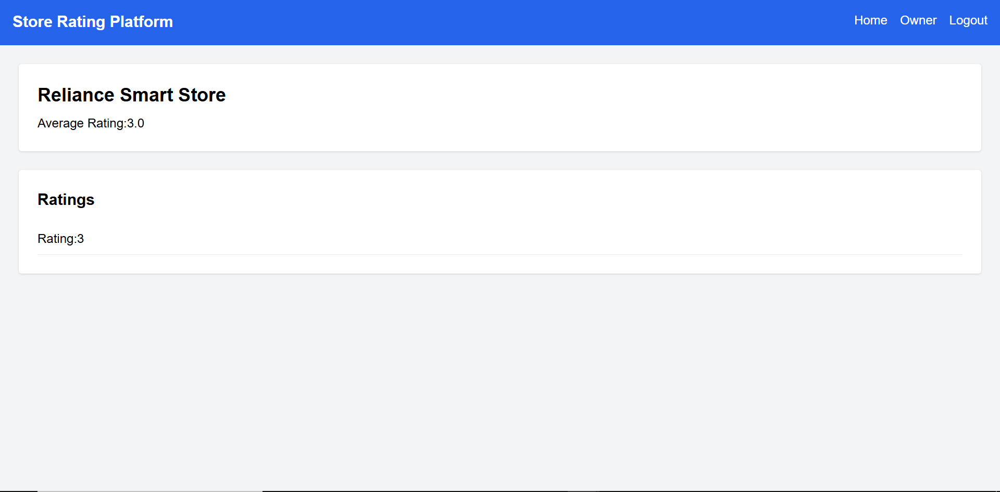

# Enterprise Store Rating Platform

A full-stack web application where users can rate stores, admins can manage stores/users, and store owners can monitor store ratings and performance.

---

# 🚀 Features

- JWT Authentication
- Role-Based Access Control
- Password Hashing using bcryptjs
- Store Rating System
- Interactive Rating Stars
- Toast Notifications
- Admin Dashboard
- User Dashboard
- Store Owner Dashboard
- Search Functionality
- Validation System
- Secure REST APIs

---

# 👥 User Roles

## 👨‍💼 Admin

Admin can:

- Add Users
- Add Stores
- View Dashboard Statistics
- Manage Store Owners
- View All Users
- View All Stores
- Assign Store Owners

---

## 👤 User

Users can:

- Register/Login
- Search Stores
- Submit Ratings
- Update Ratings
- View Average Ratings

---

## 🏪 Store Owner

Store Owners can:

- View Assigned Store
- View Average Rating
- View User Ratings
- Monitor Store Performance

---

# 🛠️ Tech Stack

## Frontend

- React.js
- React Router DOM
- Axios
- Tailwind CSS
- React Hot Toast
- React Toastify

---

## Backend

- Node.js
- Express.js
- JWT Authentication
- bcryptjs

---

## Database

- MySQL
- Sequelize ORM

---

# 📂 Project Structure

```bash
enterprise-store-rating-platform/
│
├── backend/
│   ├── src/
│   │   ├── config/
│   │   ├── controllers/
│   │   ├── middleware/
│   │   ├── models/
│   │   ├── routes/
│   │   ├── app.js
│   │   └── server.js
│
├── frontend/
│   ├── src/
│   │   ├── api/
│   │   ├── components/
│   │   ├── context/
│   │   ├── pages/
│   │   ├── styles/
│   │   └── App.jsx
│
├── screenshots/
├── README.md
└── .gitignore
```

---

# ⚙️ Installation & Setup

# 1️⃣ Clone Repository

```bash
git clone https://github.com/krantii4790/enterprise-store-rating-platform.git
```

---

# 2️⃣ Backend Setup

```bash
cd backend
npm install
```

Create `.env`

```env
PORT=5000

DB_NAME=store_rating_platform
DB_USER=root
DB_PASSWORD=yourpassword
DB_HOST=localhost

JWT_SECRET=your_secret_key
```

Start backend:

```bash
node src/server.js
```

---

# 3️⃣ Frontend Setup

```bash
cd frontend
npm install
npm run dev
```

---

# 🌐 API Routes

## 🔐 Auth Routes

| Method | Endpoint | Description |
|--------|----------|-------------|
| POST | /api/auth/register | Register User |
| POST | /api/auth/login | Login User |

---

## 👨‍💼 Admin Routes

| Method | Endpoint |
|--------|----------|
| GET | /api/admin/dashboard |
| POST | /api/admin/add-user |
| POST | /api/admin/add-store |

---

## 👤 User Routes

| Method | Endpoint |
|--------|----------|
| GET | /api/user/stores |
| POST | /api/user/rate |

---

## 🏪 Owner Routes

| Method | Endpoint |
|--------|----------|
| GET | /api/owner |

---

# 🔒 Security Features

- Password Hashing
- JWT Authentication
- Protected Routes
- Role-Based Authorization
- Secure API Access

---

# ✅ Validation Features

- Required Field Validation
- Email Validation
- Password Validation
- Rating Validation (1–5)
- Duplicate Email Prevention

---

# ⭐ Rating System

Interactive star-based rating system:

- Clickable Stars
- Live Rating Updates
- Average Rating Calculation

---

# 🔔 Toast Notifications

Toast notifications added for:

- Login Success
- Registration Success
- Errors
- Validation Messages
- Rating Submission

---

# 🖥️ Dashboards

## 👨‍💼 Admin Dashboard

Features:

- Total Users
- Total Stores
- Total Ratings
- Add Users
- Add Stores
- Search Users

---

## 👤 User Dashboard

Features:

- Search Stores
- Submit Ratings
- View Ratings
- Interactive Stars

---

## 🏪 Store Owner Dashboard

Features:

- Store Details
- Average Rating
- User Ratings

---

# 📸 Project Screenshots

## 🔐 Login Page



---

## 📝 Register Page



---

## 👨‍💼 Admin Dashboard - Statistics



---

## 👨‍💼 Admin Dashboard - Management



---

## 👤 User Dashboard



---

## 🏪 Store Owner Dashboard



---

# 👨‍💻 Author

## Krantikumar Dilip Patil

AI & Data Science Engineer

---

# ⭐ Support

If you like this project, give it a ⭐ on GitHub!
